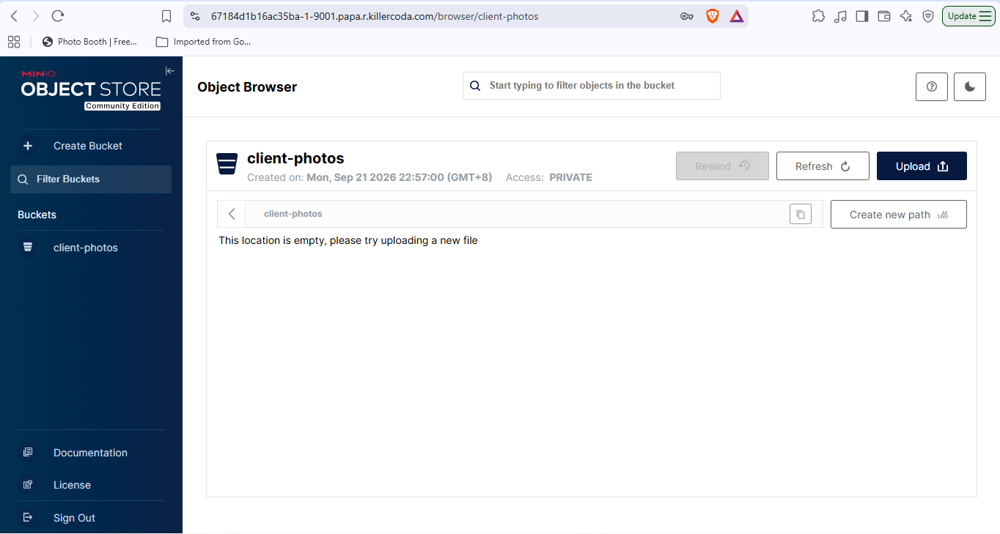

# MinIO Deployment

## Environment
- Platform: KillerCoda Ubuntu Playground
- Tool: Docker

## Docker Command Used
```bash
docker run -d -p 9000:9000 -p 9001:9001 --name minio-server \
-e "MINIO_ROOT_USER=cloudadmin" \
-e "MINIO_ROOT_PASSWORD=CloudNova2026!" \
minio/minio server /data --console-address ":9001"
```

## Command Breakdown
- `-d` – Runs the container in the background (detached mode).
- `-p 9000:9000` – Maps the S3 API port from the host to the container.
- `-p 9001:9001` – Maps the web console port from the host to the container.
- `--name minio-server` – Names the container so it is easy to manage.
- `minio/minio` – The official MinIO image from Docker Hub.
- `server /data` – Starts MinIO and stores its data in the /data directory.
- `--console-address ":9001"` – Sets the web console to listen on port 9001.

## Environment Variables (-e flags)
- `MINIO_ROOT_USER=cloudadmin` – Sets the admin username for logging in.
- `MINIO_ROOT_PASSWORD=CloudNova2026!` – Sets the admin password for logging in.

Environment variables pass configuration into the container when it starts, so the server is set up without editing any files inside it.

## Web Console Access
- Port used: **9001** (opened through KillerCoda's Traffic / Ports menu)

## Bucket Created
- Name: **client-photos**
- Uploaded a test file to confirm the storage works.

## Evidence


